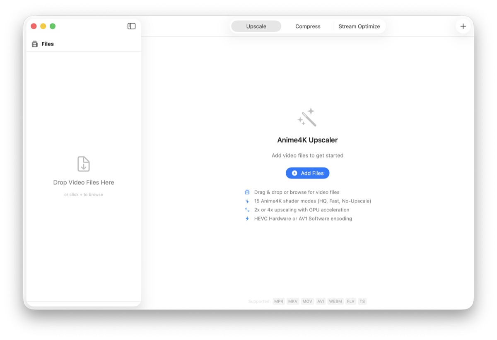
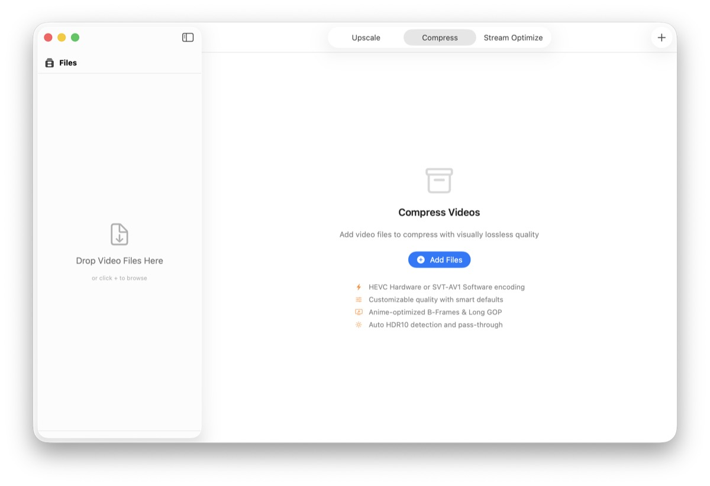
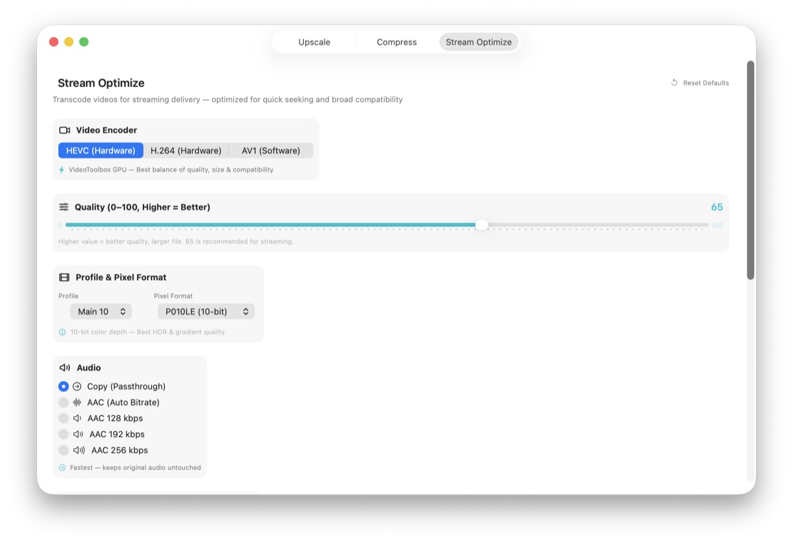

# Anime4K Upscaler for macOS

Native macOS Anime4K app with a full Metal adaptation of the Anime4K shader pipeline for the Upscale workflow.

## Key Points

- Full Metal Anime4K runtime pipeline for upscaling (no GLSL filter dependency in the Upscale path).
- Three built-in workflows: Upscale, Compress, Stream Optimize.
- Batch processing with progress, logs, and cancellation.
- HEVC/H.264 VideoToolbox and AV1 options where supported by each workflow.

## Screenshots





## Install (Unsigned Release)

This project currently ships unsigned release artifacts.

If macOS blocks first launch:

1. Open the app once (it will be blocked).
2. Go to System Settings > Privacy and Security.
3. Click Open Anyway for Anime4K Upscaler.
4. Confirm Open in the next prompt.

Alternative: in Finder, right-click the app and choose Open once.

## Build from Source

Requirements:

- macOS 14+
- Xcode 15+
- Homebrew

Install dependencies:

```bash
brew install ffmpeg molten-vk xcodegen
```

Build:

```bash
xcodegen generate
xcodebuild build -scheme "Anime4K-Upscaler" -project "Anime4K-Upscaler.xcodeproj" -configuration Release CODE_SIGN_IDENTITY="" CODE_SIGNING_ALLOWED=NO SYMROOT=build
```

## Credits

- Anime4K: https://github.com/bloc97/Anime4K
- FFmpeg: https://ffmpeg.org/
