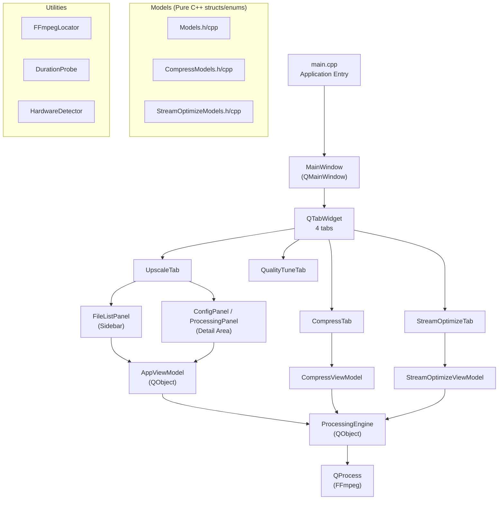

# Anime4K Upscaler — Windows Port (C++ / Qt6)

Port the macOS Anime4K Upscaler application to Windows x64 and ARM64, targeting **identical UI/UX** with full GPU hardware acceleration support for NVIDIA RTX, AMD, and Intel GPUs.

## User Review Required

> [!IMPORTANT]
> **GPU Hardware Encoding**: The macOS app uses `hevc_videotoolbox` (Apple's hardware encoder). On Windows, we will replace this with **three hardware encoder options**: NVIDIA NVENC (`hevc_nvenc` / `h264_nvenc`), AMD AMF (`hevc_amf` / `h264_amf`), and Intel QSV (`hevc_qsv` / `h264_qsv`). The app will auto-detect which GPU is available and show only valid options. **Do you want all three GPU vendors supported, or just NVIDIA + AMD?**

> [!IMPORTANT]
> **Vulkan for Shader Processing**: The macOS app uses MoltenVK (Vulkan-on-Metal) + libplacebo for Anime4K shader processing. On Windows, we will use **native Vulkan** (installed with GPU drivers) + libplacebo. Both NVIDIA and AMD have native Vulkan support. The shader `.glsl` files are mpv-format user shaders and work identically via libplacebo on all platforms. **No shader changes are needed.**

> [!WARNING]
> **FFmpeg Binary**: We need a Windows FFmpeg build compiled with `--enable-libplacebo --enable-vulkan` support. We will use [gyan.dev FFmpeg builds](https://www.gyan.dev/ffmpeg/builds/) (full GPL build includes libplacebo + Vulkan) or BtbN builds. The binary must be bundled with the app. **Alternatively, should we compile FFmpeg from source with vcpkg?**

## Open Questions

> [!IMPORTANT]
> **Installer**: Should we create an MSI/MSIX installer, or just ship as a portable ZIP with ffmpeg.exe bundled alongside?

> [!IMPORTANT]  
> **Qt6 Version**: Should we use Qt 6.7+ (latest stable) or a specific version you already have installed? Qt 6.5+ is minimum for the features we need.

---

## Architecture Overview



---

## Proposed Changes

### Build System & Dependencies

#### [NEW] [CMakeLists.txt](file:///z:/Anime4K-Upscalar-macOS/windows/CMakeLists.txt)

Top-level CMake build file. Targets both x64 and ARM64 via Visual Studio generator or Ninja.

```cmake
cmake_minimum_required(VERSION 3.25)
project(Anime4KUpscaler VERSION 1.0.0 LANGUAGES CXX)

set(CMAKE_CXX_STANDARD 20)
set(CMAKE_CXX_STANDARD_REQUIRED ON)
set(CMAKE_AUTOMOC ON)
set(CMAKE_AUTORCC ON)
set(CMAKE_AUTOUIC ON)

find_package(Qt6 REQUIRED COMPONENTS Widgets Core Gui)

# Sources (listed explicitly in the file, grouped by subdirectory)
# Resources (shaders, icons via .qrc)

qt_add_executable(Anime4KUpscaler ...)
target_link_libraries(Anime4KUpscaler PRIVATE Qt6::Widgets Qt6::Core Qt6::Gui)

# Install rules: copy ffmpeg.exe, ffprobe.exe, shaders/ alongside binary
install(TARGETS Anime4KUpscaler RUNTIME DESTINATION .)
install(DIRECTORY "${CMAKE_SOURCE_DIR}/../shaders/" DESTINATION shaders)
install(FILES "${CMAKE_SOURCE_DIR}/vendor/ffmpeg.exe" DESTINATION .)
install(FILES "${CMAKE_SOURCE_DIR}/vendor/ffprobe.exe" DESTINATION .)
```

**Key decisions**:
- Use CMake (not qmake) — industry standard, better cross-arch support
- Qt6 Widgets (not QML) — matches SwiftUI's grouped-box / split-view layout precisely with native Windows look
- Bundle FFmpeg + FFprobe as vendored binaries alongside the .exe
- Bundle shader `.glsl` files in a `shaders/` directory next to the .exe

#### [NEW] [vcpkg.json](file:///z:/Anime4K-Upscalar-macOS/windows/vcpkg.json)

vcpkg manifest for dependency management (optional, only if building FFmpeg from source).

---

### Models Layer (Pure C++ — No Qt dependency)

These files contain ALL enums, structs, and data definitions. They are direct 1:1 ports of the Swift models.

---

#### [NEW] [src/models/Models.h](file:///z:/Anime4K-Upscalar-macOS/windows/src/models/Models.h)

**Maps from**: [Models.swift](file:///z:/Anime4K-Upscalar-macOS/macos/Anime4K-Upscaler/Models/Models.swift)

This is the largest and most critical model file. Contains the following exact types:

##### `DeviceHardwareProfile` (struct)
```cpp
struct DeviceHardwareProfile {
    QString chipName;     // CPU brand string (via GetSystemInfo / CPUID on Windows)
    QString gpuName;      // GPU name (via DXGI adapter enumeration)
    int cpuCoreCount;     // via std::thread::hardware_concurrency()
    
    static DeviceHardwareProfile detect();  // Singleton factory
    QString hqModeHeader() const;           // "HQ Modes (Recommended for <chipName>)"
};
```

**Windows detection**:
- CPU name: `__cpuid` intrinsic or `GetSystemInfo()` + registry `HKLM\HARDWARE\DESCRIPTION\System\CentralProcessor\0\ProcessorNameString`
- GPU name: DXGI factory → enumerate adapters → `DXGI_ADAPTER_DESC.Description`
- CPU cores: `std::thread::hardware_concurrency()`

##### `Anime4KShader` (enum)
```cpp
enum class Anime4KShader {
    ClampHighlights,         // "Anime4K_Clamp_Highlights.glsl"
    RestoreCNN_VL,           // "Anime4K_Restore_CNN_VL.glsl"
    RestoreCNN_M,            // "Anime4K_Restore_CNN_M.glsl"
    RestoreCNN_S,            // "Anime4K_Restore_CNN_S.glsl"
    RestoreCNNSoft_VL,       // "Anime4K_Restore_CNN_Soft_VL.glsl"
    RestoreCNNSoft_M,        // "Anime4K_Restore_CNN_Soft_M.glsl"
    RestoreCNNSoft_S,        // "Anime4K_Restore_CNN_Soft_S.glsl"
    UpscaleCNN_x2_VL,        // "Anime4K_Upscale_CNN_x2_VL.glsl"
    UpscaleCNN_x2_M,         // "Anime4K_Upscale_CNN_x2_M.glsl"
    UpscaleCNN_x2_S,         // "Anime4K_Upscale_CNN_x2_S.glsl"
    UpscaleDenoiseCNN_x2_VL, // "Anime4K_Upscale_Denoise_CNN_x2_VL.glsl"
    UpscaleDenoiseCNN_x2_M   // "Anime4K_Upscale_Denoise_CNN_x2_M.glsl"
};

QString shaderFileName(Anime4KShader shader);  // Returns the .glsl filename
bool isUpscaler(Anime4KShader shader);          // true for Upscale* and UpscaleDenoise*
```

##### `Anime4KMode` (enum)
Exactly 15 modes, with integer values 1–15:
```cpp
enum class Anime4KMode {
    ModeA_HQ = 1, ModeB_HQ = 2, ModeC_HQ = 3,
    ModeAA_HQ = 4, ModeBB_HQ = 5, ModeCA_HQ = 6,
    ModeA_Fast = 7, ModeB_Fast = 8, ModeC_Fast = 9,
    ModeAA_Fast = 10, ModeBB_Fast = 11, ModeCA_Fast = 12,
    ModeAA_Fast_NoUp = 13, ModeA_HQ_NoUp = 14, ModeAA_HQ_NoUp = 15
};

QString displayName(Anime4KMode mode);     // e.g. "Mode A (HQ)"
QString subtitle(Anime4KMode mode);        // e.g. "Restore → Upscale"
ModeCategory category(Anime4KMode mode);   // HQ, Fast, or NoUpscale
bool involvesUpscaling(Anime4KMode mode);
QVector<Anime4KShader> shaderPipeline(Anime4KMode mode);  // EXACT pipeline from Swift
```

**CRITICAL**: The `shaderPipeline()` function must return the EXACT same shader sequences as the Swift code. Copy the switch statement verbatim from [Models.swift:162-267](file:///z:/Anime4K-Upscalar-macOS/macos/Anime4K-Upscaler/Models/Models.swift#L162-L267).

##### `ModeCategory` (enum)
```cpp
enum class ModeCategory { HQ, Fast, NoUpscale };
QString displayName(ModeCategory cat);
QString symbolName(ModeCategory cat);  // We'll use Unicode chars or Qt icons instead of SF Symbols
QVector<Anime4KMode> modesForCategory(ModeCategory cat);
```

##### `TargetResolution` (enum)
```cpp
enum class TargetResolution { KeepOriginal = 1, Double = 2, Quadruple = 4 };
QString displayName(TargetResolution res);
QString subtitle(TargetResolution res);
int scaleFactor(TargetResolution res);
```

##### `VideoCodec` (enum) — **WINDOWS VERSION**

> [!IMPORTANT]
> This is the BIGGEST change from macOS. Replace Apple VideoToolbox with Windows GPU encoders.

```cpp
enum class VideoCodec {
    HEVC_NVENC,     // "hevc_nvenc"   — NVIDIA RTX hardware
    HEVC_AMF,       // "hevc_amf"    — AMD hardware
    HEVC_QSV,       // "hevc_qsv"    — Intel hardware
    H264_NVENC,     // "h264_nvenc"   — NVIDIA RTX hardware
    H264_AMF,       // "h264_amf"    — AMD hardware
    H264_QSV,       // "h264_qsv"    — Intel hardware
    SVT_AV1         // "libsvtav1"   — Software (same as macOS)
};

QString displayName(VideoCodec codec);
QString subtitle(VideoCodec codec);    // Include GPU name from HardwareDetector
QString encoderName(VideoCodec codec); // FFmpeg encoder string
QString pixelFormat(VideoCodec codec);
bool usesCRF(VideoCodec codec);        // Only SVT_AV1 uses CRF
```

**Codec display names**:
- `HEVC_NVENC` → "HEVC (NVIDIA RTX)"
- `HEVC_AMF` → "HEVC (AMD)"
- `HEVC_QSV` → "HEVC (Intel)"
- `H264_NVENC` → "H.264 (NVIDIA RTX)"
- `H264_AMF` → "H.264 (AMD)"
- `H264_QSV` → "H.264 (Intel)"
- `SVT_AV1` → "AV1 (Software)"

**Pixel formats**:
- NVENC codecs: `"p010le"` (10-bit) or `"yuv420p"` (8-bit)
- AMF codecs: `"p010le"` or `"nv12"`
- QSV codecs: `"p010le"` or `"nv12"`
- SVT_AV1: `"yuv420p10le"` (same as macOS)

**Encoder-specific FFmpeg args** (replaces VideoToolbox args):

For NVENC HEVC:
```
-c:v hevc_nvenc -preset p4 -tune hq -profile:v main10 -rc vbr -cq <quality> -b:v 0
```

For AMF HEVC:
```
-c:v hevc_amf -quality quality -profile:v main10 -rc cqp -qp_i <quality> -qp_p <quality>
```

For QSV HEVC:
```
-c:v hevc_qsv -preset medium -profile:v main10 -global_quality <quality>
```

For SVT-AV1 (unchanged from macOS):
```
-c:v libsvtav1 -preset 6 -crf <quality> -svtav1-params tune=0
```

##### `CompressionMode` (enum with associated data)
```cpp
struct CompressionMode {
    enum Type { VisuallyLossless, Balanced, CustomQuality, FixedBitrate };
    Type type;
    int value; // quality or bitrate value
    
    static CompressionMode visuallyLossless();
    static CompressionMode balanced();
    static CompressionMode customQuality(int val);
    static CompressionMode fixedBitrate(int mbps);
    
    int qualityValue(VideoCodec codec) const;
    bool isFixedBitrate() const;
    int bitrateMbps() const;
    QString displayName() const;
    QString subtitle(VideoCodec codec) const;
};
```

**Quality defaults** (same as macOS):
- Visually Lossless: CRF 24 (AV1) or Quality 68 (HW encoder)
- Balanced: CRF 30 (AV1) or Quality 65 (HW encoder)

##### `CompressionPreset` (enum)
```cpp
enum class CompressionPreset { VisuallyLossless, Balanced, CustomQuality, FixedBitrate };
```

##### `JobState` (enum)
```cpp
enum class JobState { Idle, Queued, Running, Completed, Failed, Cancelled };
QString displayName(JobState state);
QColor tintColor(JobState state);  // secondary, orange, blue, green, red, yellow
bool isTerminal(JobState state);
```

##### `VideoFile` (struct)
```cpp
struct VideoFile {
    QUuid id;
    QString filePath;          // Full path (replaces URL)
    QString fileName;          // Without extension
    QString fileExtension;     // Lowercase
    qint64 fileSizeBytes;
    std::optional<double> durationSeconds;
    std::optional<int> width;
    std::optional<int> height;
    
    static VideoFile fromPath(const QString& path);
    QString formattedFileSize() const;   // Use QLocale for formatting
    QString resolutionString() const;    // "1920×1080"
    QString formattedDuration() const;   // "01:23:45"
    QString outputFileName(Anime4KMode mode, TargetResolution scale) const;
    QString outputFilePath(Anime4KMode mode, TargetResolution scale, const QString& outputDir) const;
};
```

##### `SupportedVideoExtension`
```cpp
const QSet<QString> SUPPORTED_EXTENSIONS = {"mp4", "mkv", "mov", "avi", "webm", "flv", "ts"};
```

##### `JobConfiguration` (struct)
```cpp
struct JobConfiguration {
    Anime4KMode mode;
    TargetResolution resolution;
    VideoCodec codec;
    CompressionMode compression;
    bool longGOPEnabled;
    
    static JobConfiguration defaultConfig();
};
```

##### `FFmpegProgress` (struct)
```cpp
struct FFmpegProgress {
    int frame;
    double fps;
    QString size;
    QString time;
    QString bitrate;
    QString speed;
    double timeSeconds() const;
    
    static std::optional<FFmpegProgress> parse(const QString& line);
};
```

Copy the parse logic exactly from [Models.swift:766-797](file:///z:/Anime4K-Upscalar-macOS/macos/Anime4K-Upscaler/Models/Models.swift#L766-L797).

##### `FilterGraphBuilder` (static class)
```cpp
class FilterGraphBuilder {
public:
    static QString build(
        Anime4KMode mode,
        TargetResolution resolution,
        VideoCodec codec,
        const QString& shaderDirectory
    );
};
```

**CRITICAL**: The filter graph construction must be EXACTLY the same as macOS. The core logic is:
```
For each shader in mode.shaderPipeline():
  if shader.isUpscaler AND currentScale < targetScale:
    append "libplacebo=w=iw*2:h=ih*2:custom_shader_path='<path>'"
    currentScale *= 2
  else if NOT isUpscaler:
    append "libplacebo=custom_shader_path='<path>'"
  // Skip upscaler if target scale already reached

Finally append: "format=<pixelFormat>"
Join all with ","
```

**Path escaping on Windows**: Use forward slashes or double-backslashes in the shader path. FFmpeg on Windows accepts forward slashes.

##### `FFmpegArgumentBuilder` (static class)

Port EXACTLY from [Models.swift:852-962](file:///z:/Anime4K-Upscalar-macOS/macos/Anime4K-Upscaler/Models/Models.swift#L852-L962), replacing VideoToolbox-specific args with the Windows GPU encoder args documented above.

```cpp
class FFmpegArgumentBuilder {
public:
    static QStringList build(
        const QString& inputPath,
        const QString& outputPath,
        const JobConfiguration& config,
        const QString& shaderDirectory
    );
};
```

The argument structure is:
```
-y -threads 0 -i <input>
-vf <filterGraph>
-c:v <encoder>
-map 0:v:0 -map 0:a? -map 0:s?
-c:a copy -c:s copy
<codec-specific args>      ← THIS CHANGES per Windows encoder
<compression args>
<longGOP args if enabled>  ← -g 240
-progress pipe:1
<output>
```

---

#### [NEW] [src/models/CompressModels.h](file:///z:/Anime4K-Upscalar-macOS/windows/src/models/CompressModels.h)

**Maps from**: [CompressModels.swift](file:///z:/Anime4K-Upscalar-macOS/macos/Anime4K-Upscaler/Models/CompressModels.swift)

##### `CompressEncoder` (enum)
Same as macOS but with Windows hardware encoders:
```cpp
enum class CompressEncoder {
    HEVC_NVENC,   // NVIDIA
    HEVC_AMF,     // AMD
    HEVC_QSV,     // Intel
    SVT_AV1       // Software (same)
};
```

##### `ContentType` (enum)
```cpp
enum class ContentType { LiveAction, Anime };
```

##### `HDRMode` (enum)
```cpp
enum class HDRMode { SDR, HDR10 };
```

##### `CompressConfiguration` (struct)
```cpp
struct CompressConfiguration {
    CompressEncoder encoder = CompressEncoder::HEVC_NVENC;
    int quality = 68;
    ContentType contentType = ContentType::LiveAction;
    int bFrames = 3;
    bool longGOPEnabled = false;
};
```

##### `CompressJob` (class, QObject for signals)
Same properties as macOS: state, progress, currentFrame, currentTime, speed, fps, outputPath, logLines, errorMessage, startDate, endDate, hdrMode.

##### `CompressArgumentBuilder`
Port EXACTLY from [CompressModels.swift:191-275](file:///z:/Anime4K-Upscalar-macOS/macos/Anime4K-Upscaler/Models/CompressModels.swift#L191-L275), replacing `hevc_videotoolbox` args with Windows encoder args.

For NVENC HEVC compress:
```
-c:v hevc_nvenc -preset p4 -tune hq -profile:v main10
-cq <quality>            ← maps from the 0-100 quality scale
-pix_fmt p010le
```

For AMF HEVC compress:
```
-c:v hevc_amf -quality quality -profile:v main10
-rc cqp -qp_i <quality> -qp_p <quality>
-pix_fmt p010le
```

HDR passthrough args are the SAME as macOS (color_primaries, color_trc, colorspace).

---

#### [NEW] [src/models/StreamOptimizeModels.h](file:///z:/Anime4K-Upscalar-macOS/windows/src/models/StreamOptimizeModels.h)

**Maps from**: [StreamOptimizeModels.swift](file:///z:/Anime4K-Upscalar-macOS/macos/Anime4K-Upscaler/Models/StreamOptimizeModels.swift)

##### `StreamEncoder` (enum)
```cpp
enum class StreamEncoder {
    HEVC_NVENC, H264_NVENC,     // NVIDIA
    HEVC_AMF, H264_AMF,         // AMD
    HEVC_QSV, H264_QSV,         // Intel
    SVT_AV1                      // Software
};
```

##### `StreamProfile` (enum)
```cpp
enum class StreamProfile { Main10, Main, High, Baseline };
```
Same as macOS. Each encoder has its own list of available profiles.

##### `StreamPixelFormat` (enum)
```cpp
enum class StreamPixelFormat { P010LE, NV12, YUV420P, YUV420P10LE };
```

##### `StreamAudioMode` (enum)
```cpp
enum class StreamAudioMode { Copy, AACTranscode, AAC128, AAC192, AAC256 };
```
Identical to macOS.

##### `StreamSubtitleMode` (enum)
```cpp
enum class StreamSubtitleMode { MovText, Copy, Strip };
```

##### `KeyframeInterval` (enum)
```cpp
enum class KeyframeInterval { OneSecond, TwoSeconds, ThreeSeconds, FiveSeconds, TenSeconds };
```

##### `StreamOptimizeConfiguration` (struct)
```cpp
struct StreamOptimizeConfiguration {
    StreamEncoder encoder = StreamEncoder::HEVC_NVENC;
    int quality = 65;
    StreamProfile profile = StreamProfile::Main10;
    StreamPixelFormat pixelFormat = StreamPixelFormat::P010LE;
    StreamAudioMode audioMode = StreamAudioMode::Copy;
    StreamSubtitleMode subtitleMode = StreamSubtitleMode::MovText;
    KeyframeInterval keyframeInterval = KeyframeInterval::TwoSeconds;
    bool faststart = true;
    bool allowSWFallback = true;
};
```

##### `StreamOptimizeArgumentBuilder`
Port from [StreamOptimizeModels.swift:368-473](file:///z:/Anime4K-Upscalar-macOS/macos/Anime4K-Upscaler/Models/StreamOptimizeModels.swift#L368-L473), replacing VideoToolbox encoder args with NVENC/AMF/QSV.

---

### Utilities Layer

---

#### [NEW] [src/utils/HardwareDetector.h](file:///z:/Anime4K-Upscalar-macOS/windows/src/utils/HardwareDetector.h)
#### [NEW] [src/utils/HardwareDetector.cpp](file:///z:/Anime4K-Upscalar-macOS/windows/src/utils/HardwareDetector.cpp)

**NEW — no macOS equivalent.** Detects available GPU hardware encoders on Windows.

```cpp
class HardwareDetector {
public:
    struct GPUInfo {
        QString name;
        enum Vendor { NVIDIA, AMD, Intel, Unknown } vendor;
        bool supportsNVENC = false;
        bool supportsAMF = false;
        bool supportsQSV = false;
    };
    
    static GPUInfo detectPrimaryGPU();
    static QVector<VideoCodec> availableCodecs();
    static QVector<CompressEncoder> availableCompressEncoders();
    static QVector<StreamEncoder> availableStreamEncoders();
    static DeviceHardwareProfile getHardwareProfile();
};
```

**Detection method**:
1. Use DXGI (`IDXGIFactory1::EnumAdapters1`) to enumerate GPUs
2. Check vendor ID: `0x10DE` = NVIDIA, `0x1002` = AMD, `0x8086` = Intel
3. For each vendor, probe FFmpeg encoder availability by running:
   ```
   ffmpeg -hide_banner -encoders 2>&1 | findstr "hevc_nvenc hevc_amf hevc_qsv"
   ```
4. Cache the results (runs once on app startup)

---

#### [NEW] [src/utils/FFmpegLocator.h](file:///z:/Anime4K-Upscalar-macOS/windows/src/utils/FFmpegLocator.h)
#### [NEW] [src/utils/FFmpegLocator.cpp](file:///z:/Anime4K-Upscalar-macOS/windows/src/utils/FFmpegLocator.cpp)

**Maps from**: [FFmpegLocator.swift](file:///z:/Anime4K-Upscalar-macOS/macos/Anime4K-Upscaler/Utilities/FFmpegLocator.swift)

```cpp
class FFmpegLocator {
public:
    static QString ffmpegPath();       // <appDir>/ffmpeg.exe
    static QString ffprobePath();      // <appDir>/ffprobe.exe
    static QString shaderDirectory();  // <appDir>/shaders/
    
    static QStringList validateDependencies();  // Returns missing items
    static bool isFFmpegExecutable();
    
    // Windows: no Vulkan ICD JSON needed (drivers install Vulkan natively)
    // Windows: no DYLD_LIBRARY_PATH needed (DLLs are found via PATH or exe directory)
    static QProcessEnvironment processEnvironment();
};
```

**Key differences from macOS**:
1. **No MoltenVK** — Windows has native Vulkan via GPU drivers
2. **No Vulkan ICD JSON generation** — The GPU driver registers Vulkan ICDs in the Windows registry
3. **No DYLD_LIBRARY_PATH** — DLLs are found via the exe's directory automatically
4. **Binary location**: Next to the exe (`QCoreApplication::applicationDirPath()`)
5. Shader directory: `<appDir>/shaders/`

The `processEnvironment()` method should:
```cpp
QProcessEnvironment env = QProcessEnvironment::systemEnvironment();
// Ensure PATH includes the app directory so FFmpeg can find its DLLs
env.insert("PATH", QCoreApplication::applicationDirPath() + ";" + env.value("PATH"));
return env;
```

---

#### [NEW] [src/utils/DurationProbe.h](file:///z:/Anime4K-Upscalar-macOS/windows/src/utils/DurationProbe.h)
#### [NEW] [src/utils/DurationProbe.cpp](file:///z:/Anime4K-Upscalar-macOS/windows/src/utils/DurationProbe.cpp)

**Maps from**: [DurationProbe.swift](file:///z:/Anime4K-Upscalar-macOS/macos/Anime4K-Upscaler/Utilities/DurationProbe.swift)

```cpp
struct ProbeResult {
    double durationSeconds;
    int width;
    int height;
};

class DurationProbe : public QObject {
    Q_OBJECT
public:
    // Async probe using QProcess (non-blocking)
    static void probe(const QString& filePath, std::function<void(std::optional<ProbeResult>)> callback);
    static void batchProbe(const QStringList& filePaths, std::function<void(QMap<QString, std::optional<ProbeResult>>)> callback);
    static void probeColorTransfer(const QString& filePath, std::function<void(std::optional<QString>)> callback);
};
```

FFprobe arguments are **IDENTICAL** to macOS:
- Duration: `-v error -show_entries format=duration -of csv=p=0 <file>`
- Resolution: `-v error -select_streams v:0 -show_entries stream=width,height -of csv=p=0:s=x <file>`
- Color transfer: `-v error -select_streams v:0 -show_entries stream=color_transfer -of csv=p=0 <file>`

Use `QProcess` to run ffprobe asynchronously. Parse stdout for results.

---

#### [NEW] [src/utils/SleepPreventer.h](file:///z:/Anime4K-Upscalar-macOS/windows/src/utils/SleepPreventer.h)
#### [NEW] [src/utils/SleepPreventer.cpp](file:///z:/Anime4K-Upscalar-macOS/windows/src/utils/SleepPreventer.cpp)

**Replaces**: macOS IOKit power assertions and App Nap prevention.

```cpp
class SleepPreventer {
public:
    static void preventSleep();   // SetThreadExecutionState(ES_CONTINUOUS | ES_SYSTEM_REQUIRED | ES_DISPLAY_REQUIRED)
    static void allowSleep();     // SetThreadExecutionState(ES_CONTINUOUS)
};
```

Uses Windows `SetThreadExecutionState()` API — much simpler than macOS IOKit.

---

### ViewModel Layer (QObject-based, signals/slots)

---

#### [NEW] [src/viewmodels/AppViewModel.h](file:///z:/Anime4K-Upscalar-macOS/windows/src/viewmodels/AppViewModel.h)
#### [NEW] [src/viewmodels/AppViewModel.cpp](file:///z:/Anime4K-Upscalar-macOS/windows/src/viewmodels/AppViewModel.cpp)

**Maps from**: [AppViewModel.swift](file:///z:/Anime4K-Upscalar-macOS/macos/Anime4K-Upscaler/ViewModels/AppViewModel.swift)

```cpp
class AppViewModel : public QObject {
    Q_OBJECT
public:
    // File management
    void addFiles();            // Opens QFileDialog
    void addFilesFromDrop(const QStringList& paths);
    void removeFile(const QUuid& id);
    void removeAllFiles();
    void removeSelectedFile();
    
    // Configuration
    void syncCompression();
    void updateCustomQuality(int value);
    void updateCustomBitrate(int value);
    void onCodecChanged();
    
    // Output directory
    void selectOutputDirectory();
    
    // Processing
    bool canStartProcessing() const;
    void startProcessing();
    void cancelProcessing();
    void returnToConfiguration();
    
    // Quality Tune
    void selectQualityTuneInputFile();
    void onQualityTuneCodecChanged();
    void runQualityTuneScan();
    
    // State getters (for views to bind to)
    const QVector<VideoFile>& files() const;
    QUuid selectedFileID() const;
    // ... all other properties matching the Swift ViewModel
    
signals:
    void filesChanged();
    void selectedFileChanged();
    void configurationChanged();
    void viewStateChanged();
    void processingProgressChanged();
    void qualityTuneProgressChanged();
    
private:
    QVector<VideoFile> m_files;
    QUuid m_selectedFileID;
    JobConfiguration m_configuration;
    QVector<ProcessingJob*> m_jobs;
    enum class ViewState { Configuration, Processing } m_viewState = ViewState::Configuration;
    
    // Compression UI state
    CompressionPreset m_compressionPreset = CompressionPreset::VisuallyLossless;
    int m_customQualityValue = 68;
    int m_customBitrateValue = 45;
    
    // Output
    QString m_outputDirectoryPath;
    
    // Quality Tune state (all same as Swift)
    QString m_qualityTuneInputPath;
    VideoCodec m_qualityTuneCodec;
    int m_qualityTuneRangeStart = 56;
    int m_qualityTuneRangeEnd = 80;
    // ... etc
    
    ProcessingEngine* m_engine;
};
```

**File dialog (replaces NSOpenPanel)**:
```cpp
void AppViewModel::addFiles() {
    QStringList filePaths = QFileDialog::getOpenFileNames(
        nullptr,
        "Select Video Files",
        QString(),
        "Video Files (*.mp4 *.mkv *.mov *.avi *.webm *.flv *.ts)"
    );
    // ... same logic as Swift
}
```

**No SecurityScopeManager needed** — Windows doesn't have macOS's App Sandbox. File access is unrestricted.

---

#### [NEW] [src/viewmodels/ProcessingEngine.h](file:///z:/Anime4K-Upscalar-macOS/windows/src/viewmodels/ProcessingEngine.h)
#### [NEW] [src/viewmodels/ProcessingEngine.cpp](file:///z:/Anime4K-Upscalar-macOS/windows/src/viewmodels/ProcessingEngine.cpp)

**Maps from**: [ProcessingEngine.swift](file:///z:/Anime4K-Upscalar-macOS/macos/Anime4K-Upscaler/ViewModels/ProcessingEngine.swift)

```cpp
class ProcessingEngine : public QObject {
    Q_OBJECT
public:
    void executeBatch(QVector<ProcessingJob*> jobs);
    void cancelAll();
    void cancelJob(ProcessingJob* job);
    
    bool isProcessing() const;
    int currentJobIndex() const;
    int totalJobs() const;
    double overallProgress() const;
    
signals:
    void processingStateChanged();
    void jobProgressUpdated(ProcessingJob* job);
    
private:
    void executeJob(ProcessingJob* job);
    void onProcessFinished(int exitCode, QProcess::ExitStatus exitStatus);
    void onStderrReady();
    void onStdoutReady();
    
    QProcess* m_currentProcess = nullptr;
    bool m_cancellationRequested = false;
    int m_currentJobIndex = 0;
    int m_totalJobs = 0;
    double m_overallProgress = 0.0;
    bool m_isProcessing = false;
    
    // Throttle timer for UI updates (100ms = 10Hz, same as macOS)
    QTimer* m_throttleTimer;
    
    // Pending progress values (batched, same approach as Swift)
    std::optional<int> m_pendFrame;
    std::optional<QString> m_pendTime;
    std::optional<QString> m_pendFps;
    std::optional<double> m_pendProgress;
};
```

**Key differences from macOS**:
1. Use `QProcess` instead of `Foundation.Process`
2. Use `QProcess::readAllStandardError()` / `readAllStandardOutput()` instead of Pipe/FileHandle
3. Use `QProcess::kill()` or `QProcess::terminate()` for cancellation (on Windows, `terminate()` calls `TerminateProcess()`)
4. Use `QTimer` for throttling instead of `ContinuousClock`
5. Use `SleepPreventer` instead of IOKit power assertions

**Process execution pattern**:
```cpp
void ProcessingEngine::executeJob(ProcessingJob* job) {
    QProcess* process = new QProcess(this);
    process->setProgram(FFmpegLocator::ffmpegPath());
    process->setArguments(arguments);
    process->setProcessEnvironment(FFmpegLocator::processEnvironment());
    
    connect(process, &QProcess::readyReadStandardError, this, &ProcessingEngine::onStderrReady);
    connect(process, &QProcess::readyReadStandardOutput, this, &ProcessingEngine::onStdoutReady);
    connect(process, QOverload<int, QProcess::ExitStatus>::of(&QProcess::finished),
            this, &ProcessingEngine::onProcessFinished);
    
    process->start();
}
```

---

#### [NEW] [src/viewmodels/CompressViewModel.h](file:///z:/Anime4K-Upscalar-macOS/windows/src/viewmodels/CompressViewModel.h)
#### [NEW] [src/viewmodels/CompressViewModel.cpp](file:///z:/Anime4K-Upscalar-macOS/windows/src/viewmodels/CompressViewModel.cpp)

**Maps from**: [CompressViewModel.swift](file:///z:/Anime4K-Upscalar-macOS/macos/Anime4K-Upscaler/ViewModels/CompressViewModel.swift)

Same structure as AppViewModel but for the Compress tab. Has its own file list, configuration, and processing engine. Port line-by-line from the Swift file.

---

#### [NEW] [src/viewmodels/StreamOptimizeViewModel.h](file:///z:/Anime4K-Upscalar-macOS/windows/src/viewmodels/StreamOptimizeViewModel.h)
#### [NEW] [src/viewmodels/StreamOptimizeViewModel.cpp](file:///z:/Anime4K-Upscalar-macOS/windows/src/viewmodels/StreamOptimizeViewModel.cpp)

**Maps from**: [StreamOptimizeViewModel.swift](file:///z:/Anime4K-Upscalar-macOS/macos/Anime4K-Upscaler/ViewModels/StreamOptimizeViewModel.swift)

Same structure as CompressViewModel but for Stream Optimize. Port line-by-line from the Swift file.

---

### UI Layer (Qt6 Widgets)

The macOS app has a specific look: light background, grouped sections (GroupBox), split view (sidebar + detail), tab bar at the top. We replicate this exactly with Qt6 Widgets + custom stylesheets.

---

#### [NEW] [src/ui/MainWindow.h](file:///z:/Anime4K-Upscalar-macOS/windows/src/ui/MainWindow.h)
#### [NEW] [src/ui/MainWindow.cpp](file:///z:/Anime4K-Upscalar-macOS/windows/src/ui/MainWindow.cpp)

**Maps from**: [Anime4K_UpscalerApp.swift](file:///z:/Anime4K-Upscalar-macOS/macos/Anime4K-Upscaler/Anime4K_UpscalerApp.swift) + [ContentView.swift](file:///z:/Anime4K-Upscalar-macOS/macos/Anime4K-Upscaler/Views/ContentView.swift)

```cpp
class MainWindow : public QMainWindow {
    Q_OBJECT
public:
    MainWindow(QWidget* parent = nullptr);
    
private:
    void setupUI();
    void setupMenuBar();
    void setupShortcuts();
    
    QTabWidget* m_tabWidget;
    UpscaleTab* m_upscaleTab;
    CompressTab* m_compressTab;
    StreamOptimizeTab* m_streamOptimizeTab;
    QualityTuneTab* m_qualityTuneTab;
    
    AppViewModel* m_appVM;
    CompressViewModel* m_compressVM;
    StreamOptimizeViewModel* m_streamOptimizeVM;
};
```

**Window configuration** (matches macOS):
- Minimum size: 860×540 pixels
- Default size: 1100×720 pixels
- Window title: "Anime4K Upscaler"

**Tab widget** (replaces SwiftUI TabView):
- Tab 1: "Upscale" with wand icon
- Tab 2: "Compress" with archive icon
- Tab 3: "Stream Optimize" with bolt icon
- Tab 4: "Quality Tune" with dial icon

**Menu bar** (replaces SwiftUI commands):
- File → Add Video Files... (Ctrl+O)
- File → Remove Selected File (Ctrl+Delete)
- File → Remove All Files (Ctrl+Shift+Delete)
- File → Choose Output Directory (Ctrl+Shift+D)
- Processing → Start Processing (Ctrl+R)
- Processing → Cancel Processing (Ctrl+.)
- Processing → Return to Configuration (Escape)

---

#### [NEW] [src/ui/UpscaleTab.h](file:///z:/Anime4K-Upscalar-macOS/windows/src/ui/UpscaleTab.h)
#### [NEW] [src/ui/UpscaleTab.cpp](file:///z:/Anime4K-Upscalar-macOS/windows/src/ui/UpscaleTab.cpp)

**Maps from**: [UpscaleView.swift](file:///z:/Anime4K-Upscalar-macOS/macos/Anime4K-Upscaler/Views/UpscaleView.swift)

Uses `QSplitter` (horizontal) to create the sidebar+detail layout:
```
┌──────────────────────────────────────────────────┐
│ [Toolbar: + Add Files | ▶ Start]                 │
├────────────┬─────────────────────────────────────┤
│ FileList   │ ConfigPanel OR ProcessingPanel      │
│ (sidebar)  │ (detail)                            │
│ 240-360px  │ (fills remaining space)             │
│            │                                     │
│            │                                     │
│            │                                     │
└────────────┴─────────────────────────────────────┘
```

- Left: `FileListPanel` (min 240px, ideal 280px, max 360px)
- Right: `QStackedWidget` switching between `ConfigurationPanel` and `ProcessingPanel`
- If no files: show `EmptyStateWidget` in the detail area
- Toolbar at top with "Add Files" and "Start Processing" buttons

---

#### [NEW] [src/ui/FileListPanel.h](file:///z:/Anime4K-Upscalar-macOS/windows/src/ui/FileListPanel.h)
#### [NEW] [src/ui/FileListPanel.cpp](file:///z:/Anime4K-Upscalar-macOS/windows/src/ui/FileListPanel.cpp)

**Maps from**: [FileListView.swift](file:///z:/Anime4K-Upscalar-macOS/macos/Anime4K-Upscaler/Views/Sidebar/FileListView.swift)

Layout:
```
┌─────────────────┐
│ 📁 Files    [3] │  ← Header with count badge
├─────────────────┤
│ 🎬 video1.mp4   │  ← QListWidget items
│   MP4 1.2GB     │
│   1920×1080     │
│                 │
│ 🎬 video2.mkv   │
│   MKV 3.4GB     │
│   3840×2160     │
├─────────────────┤
│ 1.5GB • 01:23   │  ← Footer with total size + duration
│            [🗑] │
└─────────────────┘
```

**Drop zone** when empty (replaces SwiftUI drop zone):
```
┌─────────────────┐
│                 │
│    ⬇️ 📄        │
│  Drop Video     │
│  Files Here     │
│                 │
│ or click + to   │
│    browse       │
│                 │
└─────────────────┘
```

Implement drag-and-drop via `QWidget::setAcceptDrops(true)` + override `dragEnterEvent` / `dropEvent`. Accept `QMimeData::urls()`, filter by extension.

Context menu on file rows: "Remove" and "Show in Explorer" (replaces "Reveal in Finder" — use `QDesktopServices::openUrl(QUrl::fromLocalFile(dir))`).

---

#### [NEW] [src/ui/EmptyStateWidget.h](file:///z:/Anime4K-Upscalar-macOS/windows/src/ui/EmptyStateWidget.h)
#### [NEW] [src/ui/EmptyStateWidget.cpp](file:///z:/Anime4K-Upscalar-macOS/windows/src/ui/EmptyStateWidget.cpp)

**Maps from**: [EmptyStateView.swift](file:///z:/Anime4K-Upscalar-macOS/macos/Anime4K-Upscaler/Views/Detail/EmptyStateView.swift)

Centered content:
```
            ✨ (large icon, animated pulse)
         Anime4K Upscaler
    Add video files to get started
         [Add Files] (blue button)

    📁 Drag & drop or browse for video files
    ✨ 15 Anime4K shader modes (HQ, Fast, No-Upscale)
    ↗️ 2x or 4x upscaling with GPU acceleration
    ⚡ HEVC/H.264 Hardware or AV1 Software encoding

    Supported: [MP4] [MKV] [MOV] [AVI] [WEBM] [FLV] [TS]
```

Use `QLabel` with rich text or `QVBoxLayout` with styled labels. The feature rows use colored icons.

---

#### [NEW] [src/ui/ConfigurationPanel.h](file:///z:/Anime4K-Upscalar-macOS/windows/src/ui/ConfigurationPanel.h)
#### [NEW] [src/ui/ConfigurationPanel.cpp](file:///z:/Anime4K-Upscalar-macOS/windows/src/ui/ConfigurationPanel.cpp)

**Maps from**: [ConfigurationPanel.swift](file:///z:/Anime4K-Upscalar-macOS/macos/Anime4K-Upscaler/Views/Detail/ConfigurationPanel.swift)

This is a `QScrollArea` containing vertically stacked `QGroupBox` sections:

**Section 1: Selected File Header**
- Film icon + filename + extension badge + file size + resolution + duration
- Batch summary line: "3 files • Mode A (HQ) • 2x Upscale • HEVC (NVIDIA RTX)"

**Section 2: Anime4K Mode** (QGroupBox)
- Header: "Anime4K Mode" with wand icon
- `ModePickerWidget` (custom scrollable list with 15 modes in 3 sections)

**Section 3: Target Resolution** (QGroupBox)
- Header: "Target Resolution"
- 3 radio buttons in a row (segmented control style): Original (1x) | 2x Upscale | 4x Upscale
- Subtitle text below

**Section 4: Video Codec** (QGroupBox)
- Header: "Video Codec"
- Radio buttons for each available hardware encoder + SVT-AV1
- **Only show codecs detected by HardwareDetector** (e.g., don't show NVENC on AMD systems)
- Subtitle text showing GPU name

**Section 5: Compression** (QGroupBox)
- Header: "Compression"
- `QComboBox` with: Visually Lossless, Balanced, Custom Quality, Custom Bitrate
- Conditional `QSlider` for custom quality (0–100 or 0–63 depending on codec)
- Conditional `QSlider` + `QSpinBox` for custom bitrate (1–200 Mbps)
- Subtitle showing current value

**Section 6: Advanced** (QGroupBox)
- Header: "Advanced"
- `QCheckBox`: "Long GOP (10 seconds)"
- Subtitle: "Saves ~10-15% space. Seeking may be slightly slower."

**Section 7: Output Directory** (QGroupBox)
- Header: "Output Directory"
- Path display + "Choose…" / "Change" button
- Uses `QFileDialog::getExistingDirectory()`

**Section 8: Start Button** (centered)
- Large blue "Start Processing" button
- "3 files queued" text below

---

#### [NEW] [src/ui/ModePickerWidget.h](file:///z:/Anime4K-Upscalar-macOS/windows/src/ui/ModePickerWidget.h)
#### [NEW] [src/ui/ModePickerWidget.cpp](file:///z:/Anime4K-Upscalar-macOS/windows/src/ui/ModePickerWidget.cpp)

**Maps from**: [ModePicker.swift](file:///z:/Anime4K-Upscalar-macOS/macos/Anime4K-Upscaler/Views/Components/ModePicker.swift)

Custom widget showing all 15 modes grouped by category:

```
★ HQ MODES (RECOMMENDED FOR <CPU NAME>)
  ✓ [1] Mode A (HQ)         Restore → Upscale
    [2] Mode B (HQ)         Soft Restore → Upscale
    [3] Mode C (HQ)         Upscale + Denoise
    [4] Mode A+A (HQ)       Double Restore → Upscale
    [5] Mode B+B (HQ)       Double Soft → Upscale
    [6] Mode C+A (HQ)       Denoise → Restore → Upscale

🐇 FAST MODES
    [7] Mode A (Fast)       Restore → Upscale
    ... (6 modes)

↩️ NO UPSCALE MODES (RESTORE ONLY)
    [13] Mode A+A (Fast)    Restore Only (Fast)
    ... (3 modes)
```

Each row is clickable. Selected row has blue highlight + checkmark. Number badge on left with blue/gray background. Implement as a custom `QWidget` with `QVBoxLayout` containing `ModeRowWidget` items.

---

#### [NEW] [src/ui/ProcessingPanel.h](file:///z:/Anime4K-Upscalar-macOS/windows/src/ui/ProcessingPanel.h)
#### [NEW] [src/ui/ProcessingPanel.cpp](file:///z:/Anime4K-Upscalar-macOS/windows/src/ui/ProcessingPanel.cpp)

**Maps from**: [ProcessingView.swift](file:///z:/Anime4K-Upscalar-macOS/macos/Anime4K-Upscaler/Views/Detail/ProcessingView.swift)

Layout:
```
┌──────────────────────────────────────────────┐
│ ⏳ Processing...                  [2/5]     │  ← Header
│ ▓▓▓▓▓▓▓▓▓▓▓▓▓▓▓░░░░░░░░░░ 60%            │  ← Overall progress
│ [Mode A (HQ)] [2x Upscale] [HEVC (NVIDIA)] │  ← Config badges
├──────────────────────────────────────────────┤
│ ✅ video1.mp4                    Done       │  ← Job list
│ ▓▓▓▓▓▓▓▓▓▓▓▓▓▓▓▓▓▓▓▓▓▓▓▓▓▓ 100%         │
│ Progress: 100%  Frame: 12000  FPS: 24.0    │
│                                              │
│ ⏳ video2.mp4                    45%        │
│ ▓▓▓▓▓▓▓▓▓▓▓▓░░░░░░░░░░░░░░ 45%           │
│ Progress: 45%  Frame: 5400  FPS: 18.2      │
│                                              │
│ ⏸ video3.mp4                    Ready      │
├──────────────────────────────────────────────┤
│ > Log Output                                 │  ← Expandable log
│ $ ffmpeg -y -threads 0 -i ...               │
│ frame=  120 fps= 24 ...                     │
├──────────────────────────────────────────────┤
│ [Show Log]              [Cancel All] [Done] │  ← Footer
└──────────────────────────────────────────────┘
```

---

#### [NEW] [src/ui/ProgressRowWidget.h](file:///z:/Anime4K-Upscalar-macOS/windows/src/ui/ProgressRowWidget.h)
#### [NEW] [src/ui/ProgressRowWidget.cpp](file:///z:/Anime4K-Upscalar-macOS/windows/src/ui/ProgressRowWidget.cpp)

**Maps from**: [ProgressRow.swift](file:///z:/Anime4K-Upscalar-macOS/macos/Anime4K-Upscaler/Views/Components/ProgressRow.swift)

Custom widget for each job in the processing view. Shows: state icon, filename, state label, progress bar, stats row (Progress%, Frame, FPS, Speed, Elapsed), and error message if failed.

---

#### [NEW] [src/ui/CompressTab.h](file:///z:/Anime4K-Upscalar-macOS/windows/src/ui/CompressTab.h)
#### [NEW] [src/ui/CompressTab.cpp](file:///z:/Anime4K-Upscalar-macOS/windows/src/ui/CompressTab.cpp)

**Maps from**: [CompressView.swift](file:///z:/Anime4K-Upscalar-macOS/macos/Anime4K-Upscaler/Views/Compress/CompressView.swift) (33KB file — large, full-featured view)

The Compress tab has a similar split-view layout with its own file list, encoder selection, quality slider, content type, B-frames, long GOP, HDR detection, output directory, and processing view. Port all configuration sections.

---

#### [NEW] [src/ui/StreamOptimizeTab.h](file:///z:/Anime4K-Upscalar-macOS/windows/src/ui/StreamOptimizeTab.h)
#### [NEW] [src/ui/StreamOptimizeTab.cpp](file:///z:/Anime4K-Upscalar-macOS/windows/src/ui/StreamOptimizeTab.cpp)

**Maps from**: [StreamOptimizeView.swift](file:///z:/Anime4K-Upscalar-macOS/macos/Anime4K-Upscaler/Views/StreamOptimize/StreamOptimizeView.swift) (34KB file — large, full-featured view)

The Stream Optimize tab has: encoder picker (HEVC/H.264/AV1), quality slider, profile & pixel format pickers, audio mode (radio buttons), subtitle mode, keyframe interval, faststart toggle, and reset defaults button. Port all sections.

---

#### [NEW] [src/ui/QualityTuneTab.h](file:///z:/Anime4K-Upscalar-macOS/windows/src/ui/QualityTuneTab.h)
#### [NEW] [src/ui/QualityTuneTab.cpp](file:///z:/Anime4K-Upscalar-macOS/windows/src/ui/QualityTuneTab.cpp)

**Maps from**: [ContentView.swift:56-209](file:///z:/Anime4K-Upscalar-macOS/macos/Anime4K-Upscaler/Views/ContentView.swift#L56-L209) (QualityTuneView is embedded in ContentView)

Sections: description GroupBox, input video selector, scan settings (codec picker, start/end/step spinners, sample seconds, target SSIM slider), run button, recommended candidate display, all candidates table.

---

#### [NEW] [src/ui/StyleSheet.h](file:///z:/Anime4K-Upscalar-macOS/windows/src/ui/StyleSheet.h)

Global Qt stylesheet to match the macOS look:
```cpp
const char* GLOBAL_STYLESHEET = R"(
    /* Light mode matching macOS */
    QMainWindow { background-color: #f5f5f7; }
    QGroupBox {
        background-color: white;
        border: 1px solid #e0e0e0;
        border-radius: 8px;
        margin-top: 8px;
        padding: 12px;
        padding-top: 24px;
    }
    QGroupBox::title {
        subcontrol-origin: margin;
        left: 12px;
        padding: 0 4px;
        font-weight: bold;
    }
    QPushButton#startButton {
        background-color: #007AFF;
        color: white;
        border-radius: 8px;
        padding: 10px 40px;
        font-size: 14px;
        font-weight: 600;
    }
    /* ... extensive stylesheet for all widgets */
)";
```

---

#### [NEW] [src/main.cpp](file:///z:/Anime4K-Upscalar-macOS/windows/src/main.cpp)

```cpp
#include <QApplication>
#include "ui/MainWindow.h"
#include "ui/StyleSheet.h"

int main(int argc, char *argv[]) {
    QApplication app(argc, argv);
    app.setApplicationName("Anime4K Upscaler");
    app.setApplicationVersion("1.0.0");
    app.setOrganizationName("Anime4K");
    app.setWindowIcon(QIcon(":/icons/app_icon.png"));
    app.setStyleSheet(GLOBAL_STYLESHEET);
    
    MainWindow window;
    window.show();
    
    return app.exec();
}
```

---

#### [NEW] [resources/resources.qrc](file:///z:/Anime4K-Upscalar-macOS/windows/resources/resources.qrc)

Qt resource file bundling icons. We'll use Unicode emoji/characters or Fluent UI icons to replace SF Symbols.

**SF Symbol → Windows icon mapping**:

| SF Symbol (macOS) | Windows Replacement | Usage |
|---|---|---|
| `wand.and.stars` | ✨ or custom SVG | Upscale tab, mode section |
| `archivebox` | 📦 or custom SVG | Compress tab |
| `bolt.badge.film` | ⚡ or custom SVG | Stream Optimize tab |
| `dial.medium` | 🎛️ or custom SVG | Quality Tune tab |
| `film` / `film.stack` | 🎬 or custom SVG | File icons |
| `play.fill` | ▶ | Start button |
| `stop.fill` | ⏹ | Cancel button |
| `plus` / `plus.circle.fill` | ➕ | Add files |
| `checkmark.circle.fill` | ✅ | Completed state |
| `xmark.circle.fill` | ❌ | Failed state |
| `folder` / `folder.fill` | 📁 | Output directory |
| `trash` | 🗑️ | Delete |
| `star.fill` | ⭐ | HQ modes section |
| `hare.fill` | 🐇 | Fast modes section |
| `terminal` | 💻 | Log output |
| `arrow.down.doc` | ⬇️📄 | Drop zone |
| `bolt.fill` | ⚡ | Hardware encoder |
| `cpu` | 🖥️ | Software encoder |
| `gearshape` | ⚙️ | Advanced settings |

---

### Directory Structure (Final)

```
windows/
├── CMakeLists.txt
├── vcpkg.json (optional)
├── vendor/
│   ├── ffmpeg.exe              (bundled, ~120MB)
│   └── ffprobe.exe             (bundled, ~120MB)
├── resources/
│   ├── resources.qrc
│   └── icons/
│       └── app_icon.png
├── src/
│   ├── main.cpp
│   ├── models/
│   │   ├── Models.h
│   │   ├── Models.cpp
│   │   ├── CompressModels.h
│   │   ├── CompressModels.cpp
│   │   ├── StreamOptimizeModels.h
│   │   └── StreamOptimizeModels.cpp
│   ├── viewmodels/
│   │   ├── AppViewModel.h
│   │   ├── AppViewModel.cpp
│   │   ├── ProcessingEngine.h
│   │   ├── ProcessingEngine.cpp
│   │   ├── CompressViewModel.h
│   │   ├── CompressViewModel.cpp
│   │   ├── StreamOptimizeViewModel.h
│   │   └── StreamOptimizeViewModel.cpp
│   ├── utils/
│   │   ├── FFmpegLocator.h
│   │   ├── FFmpegLocator.cpp
│   │   ├── DurationProbe.h
│   │   ├── DurationProbe.cpp
│   │   ├── HardwareDetector.h
│   │   ├── HardwareDetector.cpp
│   │   ├── SleepPreventer.h
│   │   └── SleepPreventer.cpp
│   └── ui/
│       ├── StyleSheet.h
│       ├── MainWindow.h
│       ├── MainWindow.cpp
│       ├── UpscaleTab.h
│       ├── UpscaleTab.cpp
│       ├── FileListPanel.h
│       ├── FileListPanel.cpp
│       ├── EmptyStateWidget.h
│       ├── EmptyStateWidget.cpp
│       ├── ConfigurationPanel.h
│       ├── ConfigurationPanel.cpp
│       ├── ModePickerWidget.h
│       ├── ModePickerWidget.cpp
│       ├── ProcessingPanel.h
│       ├── ProcessingPanel.cpp
│       ├── ProgressRowWidget.h
│       ├── ProgressRowWidget.cpp
│       ├── CompressTab.h
│       ├── CompressTab.cpp
│       ├── StreamOptimizeTab.h
│       ├── StreamOptimizeTab.cpp
│       ├── QualityTuneTab.h
│       └── QualityTuneTab.cpp
```

---

## macOS → Windows API Mapping Reference

| macOS (Swift) | Windows (C++) | Notes |
|---|---|---|
| `Foundation.Process` | `QProcess` | Process lifecycle, stdin/stdout/stderr |
| `Process.terminate()` | `QProcess::kill()` | On Windows, terminate() sends WM_CLOSE; kill() calls TerminateProcess |
| `IOKit.pwr_mgt` (power assertion) | `SetThreadExecutionState()` | Prevent sleep |
| `NSOpenPanel` (file picker) | `QFileDialog` | Video file + directory selection |
| `NSWorkspace.shared.activateFileViewerSelecting` | `QDesktopServices::openUrl(QUrl::fromLocalFile(dir))` | "Show in Explorer" |
| `URL` / `NSURL` | `QString` (file paths) | Use forward slashes, `QFileInfo` |
| `FileManager` | `QFile`, `QDir`, `QFileInfo` | File operations |
| `ByteCountFormatter` | `QLocale().formattedDataSize()` | Human-readable file sizes |
| `UUID` | `QUuid` | Unique identifiers |
| `@Observable` / `@State` | `Q_PROPERTY` + signals/slots | Reactive binding |
| `@Environment` | Constructor injection | Pass ViewModels to widgets |
| `SwiftUI.TabView` | `QTabWidget` | Top tab bar |
| `NavigationSplitView` | `QSplitter` | Sidebar + detail layout |
| `GroupBox` | `QGroupBox` | Grouped sections |
| `Picker(.segmented)` | `QButtonGroup` + `QRadioButton` or custom segment | Segmented controls |
| `Slider` | `QSlider` | Value sliders |
| `Toggle(.switch)` | `QCheckBox` | Toggle switches |
| `ProgressView(.linear)` | `QProgressBar` | Progress bars |
| `List` | `QListWidget` | File list |
| `ScrollView` | `QScrollArea` | Scrollable content |
| `Label(systemImage:)` | `QLabel` with icon + text | Icon+text pairs |
| `SF Symbols` | Unicode emoji or Fluent SVGs | See mapping table above |
| `Color.blue.opacity(0.12)` | `rgba(0, 122, 255, 31)` in QSS | Semi-transparent colors |
| `MoltenVK` (Vulkan on Metal) | Native Vulkan (GPU driver) | No translation layer needed |
| `Metal` (GPU detection) | DXGI (DirectX) | GPU adapter enumeration |
| `sysctlbyname` (CPU info) | `__cpuid` / Registry | CPU brand string |

---

## Verification Plan

### Automated Tests

```bash
# 1. Build for x64
cmake -B build-x64 -A x64 -DCMAKE_PREFIX_PATH="C:/Qt/6.7.0/msvc2022_64"
cmake --build build-x64 --config Release

# 2. Build for ARM64
cmake -B build-arm64 -A ARM64 -DCMAKE_PREFIX_PATH="C:/Qt/6.7.0/msvc2022_arm64"
cmake --build build-arm64 --config Release

# 3. Verify FFmpeg locator finds bundled binaries
# 4. Verify GPU hardware detection outputs correct vendor
# 5. Verify filter graph builder produces correct -vf strings
# 6. Process a short test video through each mode
```

### Manual Verification

1. **UI Comparison**: Screenshot the Windows app side-by-side with the macOS screenshots. Compare layout, spacing, typography, colors
2. **GPU Encoding**: Test with NVIDIA RTX GPU — verify NVENC encoders produce valid output
3. **GPU Encoding**: Test with AMD GPU — verify AMF encoders produce valid output
4. **Shader Processing**: Verify Anime4K shader upscaling produces visually identical output to macOS
5. **Drag and Drop**: Test file drag-and-drop from Windows Explorer into the file list
6. **Progress Tracking**: Verify real-time progress, FPS, speed, elapsed time display during processing
7. **Cancellation**: Verify processing can be cancelled mid-job
8. **All 4 tabs**: Test Upscale, Compress, Stream Optimize, and Quality Tune features
9. **ARM64**: Test on Windows on ARM device (Surface Pro X or similar)
